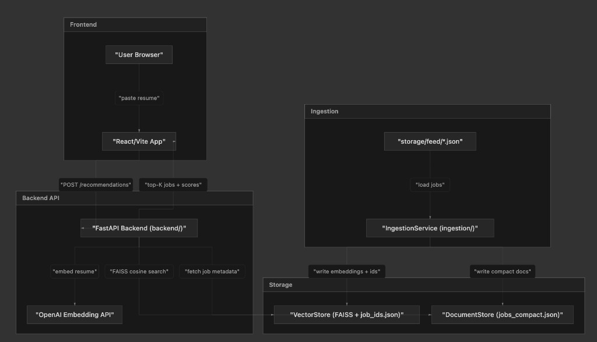

## Architecture Overview

This document provides a visual and textual overview of the system, focusing on how **ingestion**, **vector store**, **document store**, **backend API**, and **frontend** relate to each other, plus how each layer can scale.

### Component summary

| Component       | Primary scaling strategy                                                                 |
| -------------- | ---------------------------------------------------------------------------------------- |
| Ingestion      | Decouple into workers + queue; use env-based storage paths for external volumes         |
| Vector store   | FAISS → pgvector for single-node (~5M); for tens of millions + sharding, use Qdrant/Milvus with payload-based shard routing |
| Document store | Move from JSON file to a document DB (DynamoDB/MongoDB) for larger or concurrent writes |
| Backend API    | Run stateless instances behind a load balancer; share vector/doc stores across nodes    |
| Frontend       | Serve as a static build behind a CDN; configure `VITE_API_URL` and CORS per environment |

### Related Documents

- `README.md` — setup, run commands, and deployment details.
- `SPEC.md` — high-level spec, principles, and tech stack.
- `ingestion/README.md` — ingestion service details and storage layout (when present).

## Ingestion (`ingestion/`)

The ingestion service is an isolated, offline pipeline responsible for:

- Discovering raw job feeds in `storage/feed/*.json`.
- Building the text to embed from each job (`title + organization/company + description_text/description`), truncated to the configured maximum length.
- Calling the OpenAI embedding API in batches, with retries and exponential backoff on rate limits.
- L2-normalizing all embedding vectors and building a FAISS `IndexFlatIP` index.
- Persisting vectors and lightweight job metadata into the `storage/vectors/` and `storage/documents/` directories.

**Scaling strategies:**

- **Env-based paths:** Use `JOBS_INPUT_DIR`, `FAISS_INDEX_PATH`, `JOB_IDS_PATH`, and `DOCUMENTS_PATH` to point at external or mounted volumes so ingestion can run in a separate environment or container from the API.
- **Decoupled pipeline:** For larger feeds (10k+ jobs), evolve from a single script to a decoupled pipeline: raw jobs land in object storage (e.g., S3) → pushed to a queue (e.g., Kafka/SQS) → consumed by a pool of embedding workers, each responsible for batching, retries, and idempotent writes.
- **Checkpointing:** Introduce checkpoints (e.g., per-file or per-batch markers) to resume long ingestion runs without reprocessing already-embedded jobs.
- **Backpressure & rate limits:** Configure batch sizes and retry policies based on OpenAI throughput, and cap concurrency to avoid hitting provider rate limits.

## Vector Store (`storage/vectors/` + `backend.repositories.vector_store.JobVectorStore`)

The vector store holds:

- A FAISS `IndexFlatIP` index over L2-normalized embedding vectors (`faiss_index.bin`).
- A positional mapping from FAISS row index to `job_id` in `job_ids.json`.

At query time, the backend API:

- Embeds the resume text using the same OpenAI model and L2-normalizes the query vector.
- Performs an inner-product search on the FAISS index, which is equivalent to cosine similarity on normalized vectors.
- Maps FAISS indices back to stable `job_id` values via `job_ids.json`.

**Scaling strategies:**

- **pgvector single-node vs. distributed:** While pgvector is an excellent pragmatic choice for single-node scaling (up to ~5M records) due to its operational simplicity, it becomes a bottleneck in a highly distributed environment because computing distributed HNSW graphs across Postgres shards (e.g., via Citus) introduces heavy network overhead.
- **Migration to Qdrant or Milvus:** If the job corpus scales to tens of millions and requires multi-node sharding, migrate to a purpose-built distributed vector database like Qdrant or Milvus.
- **Scatter-Gather Top-K and payload-based shard routing:** The key optimization lies in native support for Scatter-Gather Top-K merging and Payload-based Shard Routing. By sharding the vector index based on explicit metadata (e.g. `job_category` or `location`), queries can be localized to specific shards, bypassing full-cluster broadcasts and maintaining single-digit millisecond latency even at massive scale.

## Document Store (`storage/documents/jobs_compact.json`)

The document store contains compact job metadata keyed by `job_id`, including:

- `title` / `title_raw`
- `organization` / `company`
- Truncated `description` suitable for in-memory loading on small instances.

The backend API uses the job IDs returned from the vector store to look up the corresponding job documents and attach them as metadata in recommendation responses.

**Scaling strategies:**

- **Compact representation:** Continue storing only the fields required for recommendations and UI rendering to minimize memory pressure at API startup.
- **External document DB:** When job volume or write concurrency increases, move this mapping from a single JSON file into a document database (e.g., DynamoDB, MongoDB) keyed by `job_id`, keeping the ID space aligned with the vector store.
- **Selective loading:** For very large corpora, consider loading only frequently-accessed subsets into memory and fetching cold documents lazily from the document DB.
- **Versioning:** Introduce schema versioning in document records when evolving job fields, so older documents can be read safely alongside newer ones.

## Backend API (`backend/`)

The backend is a FastAPI application that:

- Loads the FAISS index, job ID mapping, and compact documents at startup via `JobVectorStore`.
- Exposes:
  - `GET /health` for liveness checks.
  - `POST /recommendations` to accept resume text and a `k` value, perform embedding + FAISS search, and return the top-K jobs with scores and metadata.
- Validates inputs with Pydantic models (e.g., minimum resume length, bounds on `k`).
- Truncates long resumes, handles OpenAI errors with retries, and applies per-IP rate limiting.

**Scaling strategies:**

- **Stateless instances:** Keep the API process stateless beyond its in-memory index/doc cache so it can be horizontally scaled behind a load balancer.
- **Shared storage:** Ensure all instances read the same FAISS index and documents from a shared volume or managed vector/document stores; ingestion should not run inside API containers.
- **Configurable limits:** Make request rate limits, maximum `k`, and maximum resume length configurable via environment variables per deployment.
- **Graceful degradation:** When the embedding provider is degraded or unavailable, return clear 5xx/502 errors and avoid partial or inconsistent recommendations.

## Frontend (`frontend/`)

The frontend is a React + Vite application that:

- Renders a simple UI for pasting resume text and choosing the number of recommendations.
- Calls the backend `POST /recommendations` endpoint using `fetch`, showing loading and error states.
- Displays recommended jobs as cards, including title, company, match score, and a (potentially truncated) description with an expand/collapse toggle.

**Scaling strategies:**

- **Static hosting + CDN:** Build the app as static assets and serve it via a CDN-backed static site host; horizontal scaling is effectively handled by the CDN.
- **Configurable backend URL:** Use `VITE_API_URL` (and `BACKEND_CORS_ORIGINS` on the backend) to point the frontend at different backend environments (local, staging, production) without code changes.
- **Client-side limits:** Validate resume length and `k` client-side to avoid unnecessary backend calls and to provide faster feedback as usage grows.
- **Observability hooks:** Integrate lightweight logging or analytics (where appropriate) to track latency and error rates between frontend and backend at scale.

